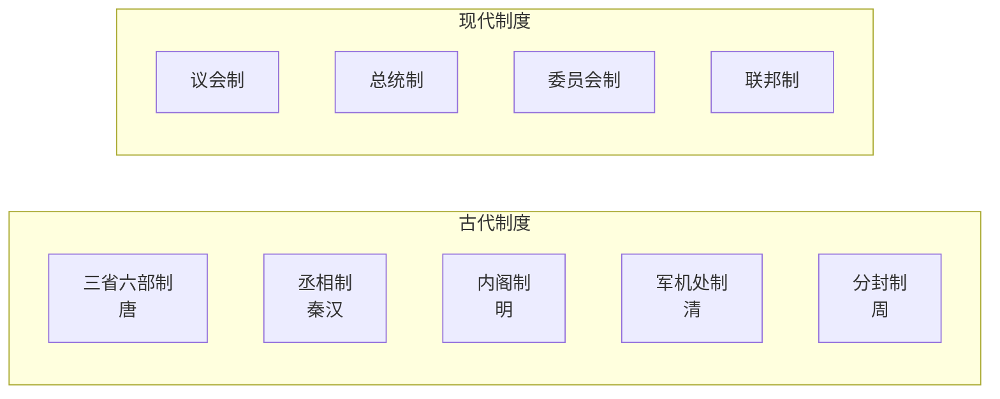
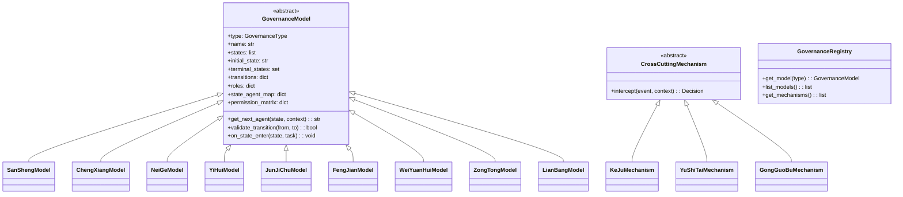

# 多制度治理架构扩展规划

## 现状分析

当前系统将三省六部制硬编码在以下核心位置：

- [task.py](edict/backend/app/models/task.py): `TaskState` 枚举、`STATE_TRANSITIONS`、`STATE_AGENT_MAP`、`ORG_AGENT_MAP` 均为全局常量
- [orchestrator_worker.py](edict/backend/app/workers/orchestrator_worker.py): 事件处理逻辑直接引用三省六部的状态和 Agent
- [task_service.py](edict/backend/app/services/task_service.py): `transition_state()` 用全局 `STATE_TRANSITIONS` 校验合法流转

改造核心思路：**抽象出"治理模型"(Governance Model)概念**，每个模型自带状态机、角色定义、权限矩阵和流转规则。任务创建时选择治理模型，编排器根据模型动态路由。

---

## 制度全景：9 种基础制度 + 3 种跨制度机制

### 基础治理制度




#### 1. 三省六部制 (san_sheng) -- 已实现

- **朝代**: 唐
- **模式**: 线性流水线 + 强制审核关卡
- **流转**: 太子 -> 中书省 -> 门下省 -> 尚书省 -> 六部 -> 审查 -> 完成
- **核心特征**: 起草/审核/执行三权分立，门下省可封驳（最多3轮）
- **适用**: 复杂任务，需要高质量保证

#### 2. 丞相制 (cheng_xiang)

- **朝代**: 秦/汉
- **模式**: 中心辐射型 (Hub-and-Spoke)，单一权力中心
- **角色**:
  - **丞相** -- 集规划/决策/协调于一身的全权代理
  - **属吏** -- 具体执行者（复用现有六部）
- **流转**: 用户 -> 丞相(规划+审核) -> 派发属吏 -> 属吏执行 -> 丞相审查 -> 回报
- **状态机**: `Pending -> Chancellor -> Dispatched -> Executing -> ChancellorReview -> Done`
- **核心特征**: 决策快、流程短，无独立审核层
- **适用**: 简单/中等任务，追求速度

#### 3. 内阁制 (nei_ge)

- **朝代**: 明
- **模式**: 集体票拟 + 御批
- **角色**:
  - **首辅** -- 内阁首席，主持讨论
  - **次辅/阁臣** -- 2-3位大学士，各有专长，集体讨论
  - **司礼监** -- 代表皇帝批红（用户可参与或自动）
- **流转**: 用户 -> 首辅主持 -> 阁臣集体票拟 -> 司礼监批红 -> 派发执行 -> 汇总 -> 完成
- **状态机**: `Pending -> CabinetReview -> PiaoNi -> PiHong -> Dispatched -> Executing -> Report -> Done`
- **核心特征**: 多Agent集体商议，智慧汇聚，皇帝有最终否决权
- **适用**: 重大决策、需要多视角分析的任务

#### 4. 议会制 (yi_hui)

- **模式**: 辩论 + 投票表决
- **角色**:
  - **议长** -- 主持辩论，维持秩序
  - **提案方** -- 提出方案的Agent
  - **反对方** -- 质疑和挑战方案
  - **委员会** -- 深入审查特定方面
- **流转**: 提案 -> 一读 -> 委员会审查 -> 二读辩论 -> 投票 -> [通过->执行] / [否决->修正重提]
- **状态机**: `Pending -> Proposed -> FirstReading -> CommitteeReview -> Debate -> Voting -> [Passed/Rejected] -> Executing -> Done`
- **核心特征**: 多方辩论、多数表决、允许修正案
- **适用**: 架构设计、技术选型等有争议的决策

#### 5. 军机处制 (jun_ji_chu)

- **朝代**: 清
- **模式**: 小圈子直报，跳过层级
- **角色**:
  - **军机大臣** -- 2-3个最信任的Agent，直接接皇帝指令
  - **军机章京** -- 处理文书的辅助Agent
- **流转**: 用户 -> 军机大臣(快速研判) -> 直接执行 -> 快速复核 -> 完成
- **状态机**: `Pending -> CouncilBriefing -> QuickDecision -> DirectExecution -> QuickReview -> Done`
- **核心特征**: 极简流程、最高效率、信任驱动
- **适用**: 紧急任务、hotfix、关键事件响应

#### 6. 分封制 (feng_jian)

- **朝代**: 周
- **模式**: 去中心化自治
- **角色**:
  - **天子** -- 高层协调者，分配领地/领域
  - **诸侯** -- 各领域的自治Agent，有完全自主权
- **流转**: 用户 -> 天子分封 -> 诸侯自治(独立规划+执行) -> 朝贡回报 -> 完成
- **状态机**: `Pending -> Enfeoffed -> LordAutonomous -> TributeReport -> Done`
- **核心特征**: 高度自治、松耦合、各领域独立运行
- **适用**: 多项目并行管理、微服务架构、独立模块开发

#### 7. 委员会制 (wei_yuan_hui)

- **模式**: 扁平化集体领导
- **角色**:
  - **委员** -- 所有Agent地位平等
  - **轮值主席** -- 轮流主持，无特权
- **流转**: 用户 -> 委员会接收 -> 全体讨论 -> 共识决策 -> 集体执行 -> 总结 -> 完成
- **状态机**: `Pending -> CommitteeReceived -> Discussion -> Consensus -> CollectiveExecution -> Summary -> Done`
- **核心特征**: 无等级、纯共识、集体负责
- **适用**: 头脑风暴、研究型任务、创意工作

#### 8. 总统制 (zong_tong)

- **模式**: 强执行者 + 顾问团
- **角色**:
  - **总统** -- 有最终决定权的强领导
  - **顾问团** -- 提供建议但不做决策
  - **内阁部长** -- 具体执行者
- **流转**: 用户 -> 总统接收 -> 咨询顾问团 -> 总统拍板 -> 部长执行 -> 总统审查 -> 完成
- **状态机**: `Pending -> PresidentReceived -> AdvisoryConsultation -> PresidentDecision -> CabinetExecution -> PresidentReview -> Done`
- **核心特征**: 果断领导、有参谋但不受制约
- **适用**: 需要快速决断且有方向感的任务

#### 9. 联邦制 (lian_bang)

- **模式**: 多级治理，联邦 + 州
- **角色**:
  - **联邦政府** -- 跨域协调、全局规则
  - **州政府** -- 域内自治、具体执行
- **流转**: 用户 -> 联邦接收 -> 分配州 -> 州自治执行 -> 联邦协调(如有跨州) -> 汇总 -> 完成
- **状态机**: `Pending -> FederalReceived -> StateAssignment -> StateAutonomous -> FederalCoordination -> Summary -> Done`
- **核心特征**: 中央与地方的平衡
- **适用**: 复杂的跨领域任务，既需协调又需自主

---

### 跨制度机制（可与任何基础制度叠加）

#### A. 科举制 (ke_ju) -- Agent竞选机制

- **机制**: 在派发执行者之前，让多个候选Agent"应试"（提交方案摘要），择优录用
- **触发点**: 任何制度的"派发"环节
- **实现**: `CompetitiveSelection` 中间件，在 dispatch 前插入竞选环节

#### B. 御史台 (yu_shi_tai) -- 独立监察

- **机制**: 独立的监察Agent全程旁听，可随时上疏弹劾（标记异常/暂停任务）
- **触发点**: 所有状态变更事件
- **实现**: `OversightMonitor` 订阅所有事件总线 topic，独立评估

#### C. 功过簿 (gong_guo_bu) -- 绩效追踪

- **机制**: 记录每个Agent的任务成功率、响应时间、被封驳次数等
- **触发点**: 任务完成、状态回退
- **实现**: `MeritTracker` 服务，影响未来任务的Agent选择权重

---

## 架构设计：治理策略模式 (Governance Strategy Pattern)




---

## 核心改造点

### 1. 新建: 治理模型包 `edict/backend/app/governance/`

```
edict/backend/app/governance/
  __init__.py
  base.py              # GovernanceModel 抽象基类 + GovernanceType 枚举
  registry.py          # 治理模型注册表 + 工厂
  san_sheng.py         # 三省六部制 (从 task.py 重构)
  cheng_xiang.py       # 丞相制
  nei_ge.py            # 内阁制
  yi_hui.py            # 议会制
  jun_ji_chu.py        # 军机处制
  feng_jian.py         # 分封制
  wei_yuan_hui.py      # 委员会制
  zong_tong.py         # 总统制
  lian_bang.py         # 联邦制
  mechanisms/
    __init__.py
    ke_ju.py           # 科举制-竞选机制
    yu_shi_tai.py      # 御史台-监察机制
    gong_guo_bu.py     # 功过簿-绩效追踪
```

`base.py` 中定义核心抽象：

```python
class GovernanceType(str, Enum):
    SAN_SHENG = "san_sheng"
    CHENG_XIANG = "cheng_xiang"
    NEI_GE = "nei_ge"
    YI_HUI = "yi_hui"
    JUN_JI_CHU = "jun_ji_chu"
    FENG_JIAN = "feng_jian"
    WEI_YUAN_HUI = "wei_yuan_hui"
    ZONG_TONG = "zong_tong"
    LIAN_BANG = "lian_bang"

class GovernanceModel(ABC):
    type: GovernanceType
    name: str
    description: str

    @abstractmethod
    def get_states(self) -> list[str]: ...
    @abstractmethod
    def get_initial_state(self) -> str: ...
    @abstractmethod
    def get_transitions(self) -> dict[str, set[str]]: ...
    @abstractmethod
    def get_state_agent_map(self) -> dict[str, str]: ...
    @abstractmethod
    def get_permission_matrix(self) -> dict[str, set[str]]: ...
    
    def validate_transition(self, from_state: str, to_state: str) -> bool:
        return to_state in self.get_transitions().get(from_state, set())
    
    def get_next_agent(self, state: str, context: dict) -> str | None:
        return self.get_state_agent_map().get(state)
```

### 2. 修改: Task 模型 ([task.py](edict/backend/app/models/task.py))

- 将 `state` 字段从 `Enum(TaskState)` 改为 `String`，支持不同制度的不同状态
- 新增 `governance_type` 字段 (`String`, default="san_sheng"`)
- 新增 `governance_config` 字段 (`JSONB`, 可选的制度特有配置)
- 新增 `mechanisms` 字段 (`JSONB`, 叠加的跨制度机制列表)
- 保留现有 `TaskState` 枚举用于向后兼容，但各制度定义自己的状态集

### 3. 修改: TaskService ([task_service.py](edict/backend/app/services/task_service.py))

- `create_task()` 接受 `governance_type` 参数
- `transition_state()` 从 GovernanceRegistry 获取对应模型来校验流转合法性（替代全局 `STATE_TRANSITIONS`）
- 添加 `get_governance_info()` 返回当前任务的治理模型信息

### 4. 修改: OrchestratorWorker ([orchestrator_worker.py](edict/backend/app/workers/orchestrator_worker.py))

- `_handle_event()` 根据任务的 `governance_type` 加载对应模型
- `_on_task_status()` 使用模型的 `get_next_agent()` 确定目标Agent（替代硬编码的 `STATE_AGENT_MAP`）
- 支持跨制度机制的拦截点（如科举制在 dispatch 前拦截）

### 5. 修改: Tasks API ([tasks.py](edict/backend/app/api/tasks.py))

- `TaskCreate` schema 新增 `governance_type` 和 `mechanisms` 字段
- 新增 `GET /api/governance/` 列出所有可用治理模型
- 新增 `GET /api/governance/{type}` 获取模型详情（状态机、角色、权限等）

### 6. 新增: Agent SOUL 文件

新制度需要的新 Agent 角色：

- `agents/chengxiang/SOUL.md` -- 丞相
- `agents/shoufu/SOUL.md` -- 内阁首辅
- `agents/yizhang/SOUL.md` -- 议长
- `agents/junji_dachen/SOUL.md` -- 军机大臣
- `agents/tianzi/SOUL.md` -- 天子/联邦协调者
- `agents/yushi/SOUL.md` -- 御史（监察）

部分角色可复用现有Agent（如六部作为各制度的执行层）。

### 7. 数据库迁移

Alembic migration 添加:

- `tasks.governance_type` VARCHAR(32) DEFAULT 'san_sheng'
- `tasks.governance_config` JSONB DEFAULT '{}'
- `tasks.mechanisms` JSONB DEFAULT '[]'
- `tasks.state` 从 Enum 类型改为 VARCHAR（支持动态状态名）

### 8. 前端改造

- 任务创建时增加"治理制度选择器"
- 看板视图根据不同制度显示对应的状态列
- 制度说明页面（各制度的介绍、流程图、适用场景）

---

## 兼容性策略

- 默认制度保持 `san_sheng`（三省六部制），所有未指定制度的任务走现有流程
- 现有的 `TaskState` 枚举作为三省六部制的状态子集保留
- 旧版 API（`legacy.py`）不受影响
- 前端看板保持现有功能，新增制度选择为可选功能

---

## 各制度适用场景速查

- **三省六部制**: 复杂任务 + 高质量保证
- **丞相制**: 简单任务 + 快速交付
- **内阁制**: 重大决策 + 多视角分析
- **议会制**: 技术选型 + 架构评审
- **军机处制**: 紧急事件 + hotfix
- **分封制**: 多项目并行 + 模块独立
- **委员会制**: 头脑风暴 + 创意研究
- **总统制**: 果断决策 + 有方向感的任务
- **联邦制**: 跨领域协作 + 中央与地方平衡

